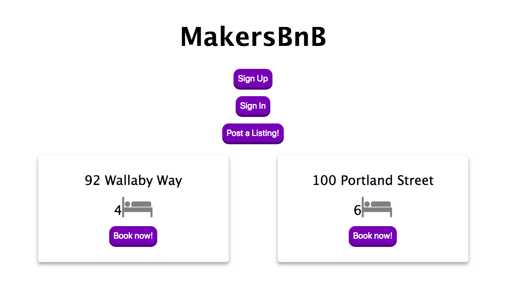

# MakersBnB

[](https://travis-ci.com/ShinyVerse/MakersBnB)
[](https://coveralls.io/github/ShinyVerse/MakersBnB)
[](https://opensource.org/licenses/MIT)


This repository is a clean clone of AirBnB which has been implemented by creating a remote API and a separate front end. We created this as a first team project at [Makers Academy](makers.tech), over the course of five days.

## Installation

To clone the project to your local machine run

```sh
git clone https://github.com/shinyverse/makersbnb
```

Next, install all the dependencies using npm:

```sh
npm install
```

### Testing
To run the tests, run:
```sh
npm run test_coverage
```
This runs `nyc` and `jasmine` and will also generate a coverage report locally.

### Usage

Before the front end can be used, the API must be run and hosted. To run the API on your `localhost` run `node api.js`, which will load the api to `http://localhost:3000`. You can choose to host this through `ngrok`, if you like.

Next, go to the `src/inferface.js` file and change the `RootURL` on line 1:
```javascript
let rootURL = 'http://localhost:3000'
```
To open the front end, run `node frontend.js`.

## Technologies
The remote API has been built using Node.js with Express.js for the routing and Mongoose for integration with the MongoDB database. The `Connection` class uses the Mongoose `Schema` constructor to structure the database. The Schema themselves are quite simple:

```javascript
var mongoose = require('mongoose');

const userSchema = new mongoose.Schema({
  name: String,
  email: String,
  password: String
});
```

The front end is powered by jQuery and Express.js. There is an `APIConnection` class in the `src` folder, through which all the other classes access the API. Throughout the front end we used Javascript's `Promise` class to deal with the asynchronicity of API calls. Checking which listings the user has uploaded requires two `then` uses:

```javascript

ListingHandler.prototype.queryOwnListings = function(owner_id) {
  let listings = this.queryListings();
  let output = []
  return listings.then((res, rej) => {        // first then
      for (i = 0; i < res.length; i += 1) {
        if (res[i].owner_id === owner_id) {
          output.push(res[i])
        }
      }
    }).then(() => {                           // second then
      return output
    })
}
```

Lastly, out front end has been very nicely styled with CSS, and is compatible with mobile screens as well as desktop:



## MVP User stories

We started with a list of five user stories which represented our minimum viable product, all of which have been implemented.

### User authentication
```
As a user
I can sign up
So that I have a unique profile
```
```
As  signed up user
I can sign in
So that I can access my profile
```
### Users can post listings
```
As a signed in user
I can post a listing
So that other users can see it
```
### Users can manage bookings
```
As a signed in user
I can request to book a listing
So that I can stay at a property
```
```
As a signed in user
I can see the bookings I have made
So that I know where I am due to be staying
```

## Team
 - [Laura Jackson](https://github.com/shinyverse)
 - [Cristina María Ocaña Manzano](https://github.com/cristinaocanamanzano)
 - [Andres Faraone-Pirie](https://github.com/afaraone)
 - [Cameron Whitehead](https://github.com/camjw)

## License
This repo is licensed under the MIT license.

## Contributing
We did not have time to:
- Implement password encryption with `bcryptjs`.
- Implement listing images.
- Implement many other features, including payment with [Stripe](https://stripe.com).

If anyone wants to implement these features, or others, we would be happy to receive a pull request.
